# Goalia Backend

Backend service for Goalia, designed to provide football match data and predictions to a separate Kotlin Multiplatform client for Android and iOS.

The service is built with FastAPI, fetches match data from football-data.org, caches responses, enriches matches with predictions from a CatBoost model, and exposes the result through `GET /api/matches`.

## Architecture

<a href="https://matemink.github.io/goalia-backend/">
  <picture>
    <source media="(prefers-color-scheme: dark)" srcset="docs/diagrams/overview-dark.svg">
    
  </picture>
</a>

[Explore the interactive map](https://matemink.github.io/goalia-backend/) · [Diagram source and refresh guide](docs/diagrams/README.md)
